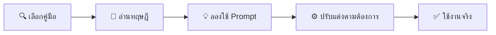

# 🎨 คู่มือการใช้งาน AI

**แหล่งรวมความรู้ AI สำหรับการศึกษาและการทำงาน**

📚 *จัดทำโดย อาจารย์ ดร.กริชบดินทร์ ผิวหอม มรภ ศรีสะเกษ*

---

## 📚 คู่มือที่มีในชุดนี้

<table>
<tr>
<td align="center" width="33%">

 

</td>
<td align="center" width="33%">

 

</td>
<td align="center" width="33%">

 

</td>
</tr>
<tr>
<td align="center">

 

</td>
<td align="center">

 

</td>
<td align="center">

 

</td>
</tr>
<tr>
<td align="center">

 

</td>
<td align="center" colspan="2">

 

</td>
</tr>
</table>

---

## 🎨 การออกแบบโลโก้

> **หลักการ RGC • 5 ตัวอย่าง Prompt สำหรับ AI • เหมาะสำหรับชมรมนักศึกษา**

---

## 🚀 วิธีใช้งาน

### 📋 ขั้นตอนการใช้งาน

| ขั้นตอน | การดำเนินการ | หมายเหตุ |
|---------|-------------|----------|
| **1️⃣** | **คลิกที่คู่มือ** ที่สนใจข้างบน | เลือกตามความต้องการ |
| **2️⃣** | **อ่านทฤษฎี** และทำความเข้าใจหลักการ | ทำความเข้าใจก่อนปฏิบัติ |
| **3️⃣** | **ลองใช้ Prompt** กับ AI tools | ทดสอบกับเครื่องมือจริง |
| **4️⃣** | **ปรับแต่ง** ตามความต้องการ | ปรับให้เหมาะกับงาน |

---

## 🔗 ลิงก์ที่เป็นประโยชน์

### 🤖 AI Tools สำหรับสร้างภาพ

### 🎨 เครื่องมือออกแบบ

---

## 📊 สถิติการใช้งาน

---

## 🌟 Features

- ✅ **7 Workshop ครบครัน** - ครอบคลุมการใช้งาน AI ในหลากหลายด้าน
- ✅ **ตัวอย่าง Prompt** - พร้อมใช้งานจริง
- ✅ **การออกแบบโลโก้** - ด้วยหลักการ RGC
- ✅ **เหมาะกับทุกระดับ** - จากผู้เริ่มต้นถึงขั้นสูง
- ✅ **อัพเดตต่อเนื่อง** - เนื้อหาใหม่ล่าสุด
- ✅ **ฟรี 100%** - เข้าถึงได้ทุกคน

---

## 🎯 สำหรับใคร?

<table>
<tr>
<td align="center" width="25%">
<h3>🎓 นักศึกษา</h3>

เรียนรู้เทคโนโลยี AI สำหรับการศึกษา

</td>
<td align="center" width="25%">
<h3>👨‍🏫 ผู้สอน</h3>

นำ AI มาใช้ในการเรียน การสอน

</td>
<td align="center" width="25%">
<h3>💼 คนทำงาน</h3>

เพิ่มประสิทธิภาพ ในการทำงาน

</td>
<td align="center" width="25%">
<h3>🚀 ผู้เริ่มต้น</h3>

หัดใช้ AI จากพื้นฐาน ไปสู่ขั้นสูง

</td>
</tr>
</table>

---

## 📞 ติดต่อ

### 👨‍🏫 อาจารย์ ดร.กริชบดินทร์ ผิวหอม

### 📱 QR Code สำหรับติดต่อ

---

## 🤝 Contributing

การมีส่วนร่วมยินดีรับ! หากคุณมีไอเดียหรือต้องการปรับปรุง:

1. 🍴 Fork repository นี้
2. 🌿 สร้าง feature branch (`git checkout -b feature/AmazingFeature`)
3. 💾 Commit การเปลี่ยนแปลง (`git commit -m 'Add some AmazingFeature'`)
4. 📤 Push ไปยัง branch (`git push origin feature/AmazingFeature`)
5. 📮 เปิด Pull Request

---

## 📝 License

โครงการนี้อยู่ภายใต้ MIT License - ดูไฟล์ [LICENSE](LICENSE) สำหรับรายละเอียด

---

## ⭐ ถ้าคู่มือนี้มีประโยชน์ กด Star ให้ด้วยนะครับ! ⭐

---

**Made with ❤️ by SSKRU**

